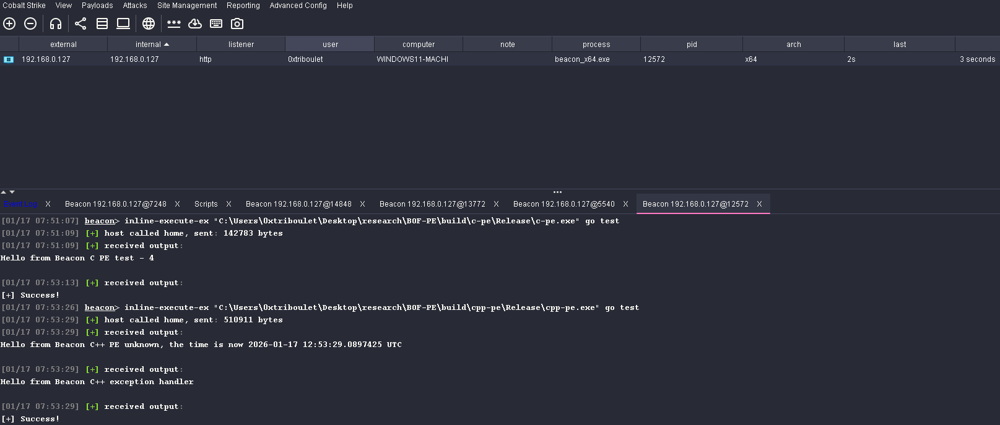

# InlineExcuteEx
Beacon Object Files (BOFs) in the Cobalt Strike ecosystem are intended to be an abstraction of [Position Independent Code (PIC)](https://aff-wg.org/). To maximize
the benefits of this, Cobalt Strike pre-processes BOFs to strip away sections that are not needed to achieve code execution. This design
confers some advantages for users of the framework. It reduces the size of the BOF that Beacon receives from the Teamserver, and the BOF 
loader in Beacon is very small compared to other BOF implementations. Unfortunately, this pre-processing has the inadvertent effect of
reducing the features available from a BOF because the additional information is not available to Beacon at load-time. `InlineExcuteEx`
implements [COFFLoader](https://github.com/trustedsec/COFFLoader), and a couple of changes ported from [bof-launcher](https://github.com/The-Z-Labs/bof-launcher), as a Cobalt Strike compatible BOF. That means this BOF can be used to fire other BOFs
in a more complete way than what is currently possible from Beacon.

The obvious trade here is that you lose the approximate lightness of PIC offered by Beacon's BOF loader, in favor of a heavier abstraction. This is a nuance that may or may not be relevant to your use case. The intent of this implementation is to offer users of the framework a *choice*.

## Basic Usage
Load `inline-execute-ex.cna` from the `Script Manager`. This will make the `inline-execute-ex` command available to you.

```
BOF+
====
[EXPERIMENTAL] BOF Loader.

	[EXPERIMENTAL] I heard you like BOFs. So I put a BOF in your BOF.
```

You can use the `help inline-execute-ex` command to get some usage information from the command line.

```
beacon> help inline-execute-ex
# 1 - a string containing the BOF file
# 2 - the entry point to call
# 3 - arguments to pass to the BOF file

Usage: inline-execute-ex 'bof.o' 'go' 'hello world!'
```

## BOF-PE Compatability
`InlineExecuteEx` neatly wraps both BOF-PE and BOF compatability into a single BOF. This means that you can access all the features of a BOF-PE, without worrying about any extra gymnastics in your `.cna` script. In fact, calling `inline-execute-ex` from a Beacon console will also work as expected.



## Access BOF API from PIC
[Crystal Palace](https://tradecraftgarden.org/crystalpalace.html) and other PIC development templates/frameworks have made it possible to more easily develop position-independent code. Unfortunately, using PIC as a postex tradecraft format comes with the headache of trying to send output to your Beacon console. 

`InlineExecuteEx` offers a custom entry point convention that passes in BOF APIs to PIC via a crude vtable. To access this functionality, pass in `"pic"` as the entry point from your `.cna` or from the Beacon console.

All of this goes to say, you can write something like this

```c
#include <windows.h>

// These definitions are available in `api_table.h`
#define API_TABLE_VERSION 0x1

typedef struct API_TABLE {
    DWORD version; // You can use this to protect yourself from crashes if I ever change this definition (ie `if (version > 0x1) return;`)
 ...snip...
    PVOID toWideChar;
} API_TABLE, *PAPI_TABLE;

#define CALLBACK_OUTPUT      0x0

// You'll need to manually define the things you want, maybe at some point I'll provide standard ones in `api_table.h`
typedef void (*BeaconPrintf_t)(int type, char* fmt, ...);
typedef void (*memcpy_t)(void* dest, const void* src, size_t count);
typedef void (*memset_t)(void* dest, int value, size_t count);

void __cdecl go (CHAR * arg, INT argSize, PAPI_TABLE apiTable) {
    char buffer[256];
	// Cast the pointer to a function and call it
    ((memset_t)(apiTable->memset))(buffer, 0, sizeof(buffer));
    ((memcpy_t)(apiTable->memcpy))(buffer, arg, argSize);
    ((BeaconPrintf_t)(apiTable->BeaconPrintf))(CALLBACK_OUTPUT, buffer);
}
```

Once you've compiled the code above, you can extract the `.text` section via whatever mechanism happens to be your favorite. And you'll then be able to execute it from the Beacon console like this.

```sh
[01/17 11:43:04] beacon> inline-execute-ex "C:\Users\0xtriboulet\<snip>\pic.x64.o" pic test
[01/17 11:43:05] [+] host called home, sent: 34943 bytes
[01/17 11:43:05] [+] received output:
test # <--- We printed the argument to the Beacon console from PIC!
[01/17 11:43:05] [+] received output:
[+] Success!
```


## Drop-In Replacement for `beacon_inline_execute`
Conventional `.cna` scripts register an alias that calls `beacon_inline_execute` to task Beacon to run a BOF. If you want to use `InlineExecuteEx` instead of the default BOF loader for a capability, you can move the `inline-execute-ex.cna` script, the `Release` directory, and the `x64` directory to the same directory as your BOF's `.cna` script.

```sh
    Directory: C:\CS-Situational-Awareness-BOF\SA


Mode                 LastWriteTime         Length Name
----                 -------------         ------ ----
[...snip...]
d-----        10/15/2025   4:28 PM                Release
d-----        10/15/2025   4:28 PM                x64
-a----        10/15/2025   4:42 PM           2153 inline-execute-ex.cna
-a----        10/15/2025   4:31 PM          45298 SA.cna
```

Then include the `inline-execute-ex.cna` in your BOF's cna script.
```perl
# SA.cna
include(getFileProper(script_resource("inline-execute-ex.cna"))); # This is the line you want to add

%recordmapping = %(
A => 1,
NS => 2,
MD => 3,
MF => 4,
[...snip...]
```

Lastly, replace calls to `beacon_inline_execute` with `beacon_inline_execute_ex`.
```perl
alias dir {
	local('$params $keys $args $targetdir $subdirs $ttp $text');

[...snip...]

    # We changed the line below
	beacon_inline_execute_ex($1, readbof($1, "dir", $msg, $ttp), "go", $args);
}
```
Then reload your `.cna` in the `Script Manager`. If all goes well, you should see this when you run the alias.
```sh
[10/15 16:36:25] beacon> dir
[10/15 16:36:25] [+] Running dir (T1083)
[10/15 16:36:25] [*] Running dir (T1083)
[10/15 16:36:25] [*] Running InlineExecuteEx. # <----- It works!
[10/15 16:36:26] [+] host called home, sent: 23152 bytes
[10/15 16:36:26] [+] received output:
Contents of .\*:
	10/15/2025 16:25           <dir> .
	09/07/2025 15:20           <dir> ..
	10/12/2025 12:00          575216 beacon_x64.exe
[...snip...]
	                        66840774 Total File Size for 2 File(s)
	                                                      8 Dir(s)

[10/15 16:36:26] [+] received output:
[+] Success!

```

## Beacon Object File Visual Studio Template

See the [BOF-VS](https://github.com/Cobalt-Strike/bof-vs) repository for more information about the template behind this BOF.